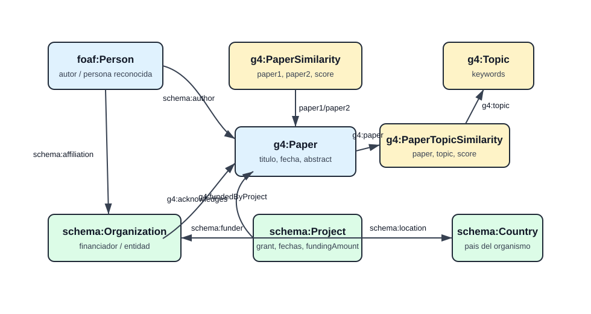

# Caso de uso y ontologia

## Objetivo

La aplicacion busca analizar la relacion entre publicaciones cientificas, autores, proyectos y entidades financiadoras. El caso de uso principal es identificar patrones en la distribucion geografica de la financiacion cientifica: que paises financian mas papers, que organismos aparecen como financiadores, que proyectos/grants estan asociados y que topics reciben mas financiacion conocida.

## Preguntas que responde

- Que paises aparecen asociados a financiacion cientifica en el KG.
- Que organismos financiadores tienen mas papers asociados.
- Que proyectos o grants financian cada paper.
- Que topics cubren los papers financiados.
- Que papers son similares semanticamente.
- Que autores y personas reconocidas aparecen, incluyendo ORCID cuando existe.

## Fuentes externas

- ORCID: identificadores y metadatos de autores/personas.
- Wikidata: informacion de organizaciones y paises.
- OpenAIRE: informacion de proyectos, grants, fechas, financiadores e importes cuando existen.

## Ontologia

La ontologia esta definida en `assigment_2/step_1/ontology/ontology.ttl`. Modela papers, personas, organizaciones, proyectos, paises, topics, similitudes y relaciones de financiacion.

Relaciones principales:

- `schema:author`: paper -> autor.
- `g4:acknowledges`: paper -> entidad mencionada en acknowledgements.
- `g4:fundedByProject`: paper -> proyecto/grant.
- `schema:funder`: proyecto -> organismo financiador.
- `schema:location`: organizacion -> pais.
- `g4:paper` y `g4:topic`: relacion paper-topic.
- `g4:paper1` y `g4:paper2`: relacion de similitud entre papers.

Nota: la propiedad `g4:algorihtm` conserva la errata original de la ontologia y del TTL generado.
