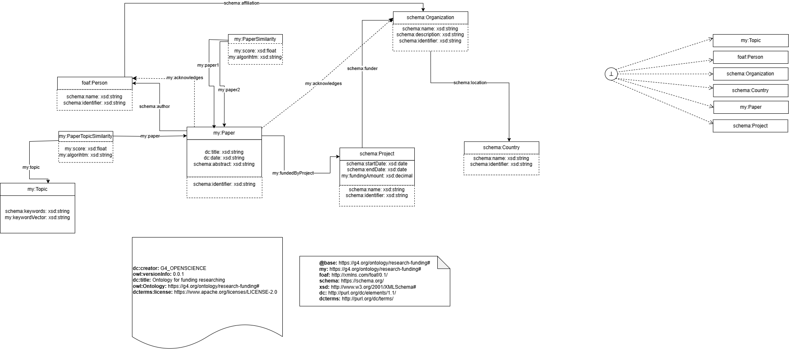
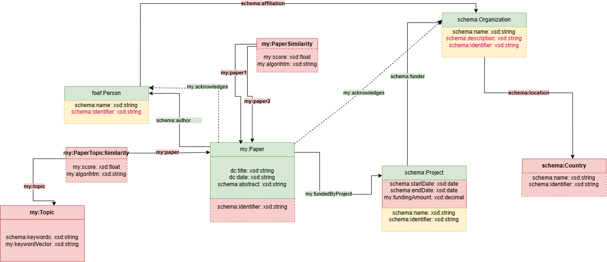
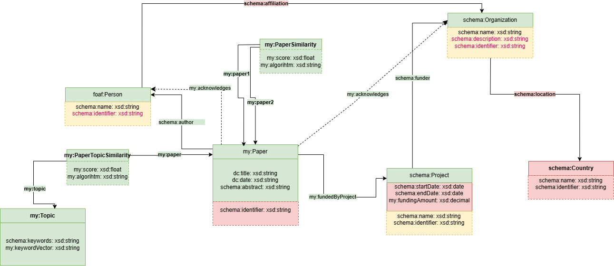
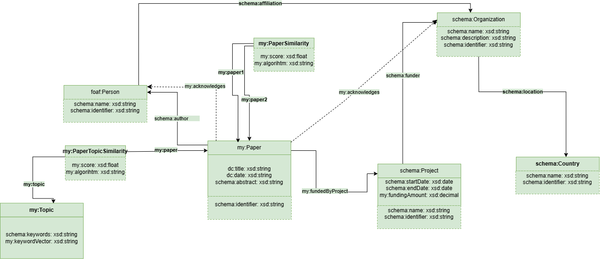

# Pipeline de datos

## Step 1: definicion

En `assigment_2/step_1` se define el caso de uso, la ontologia y las fuentes externas. Esta fase fija que la app se centre en financiacion cientifica, paises, organismos, proyectos, papers, autores, topics y similitudes.

## Step 2: XML y NER

Antes de ejecutar el Step 2 es necesario haber generado XML TEI desde PDFs mediante GROBID y PipeGrobid. Los XMLs son la entrada para extraer informacion estructurada de los papers.

Partes principales:

1. Parseo de XMLs generados por GROBID.
2. Creacion y validacion de corpus de acknowledgements.
3. Evaluacion de modelos NER/LLM.
4. Extraccion de personas, organizaciones y proyectos desde acknowledgements.

El resultado alimenta el KG con autores, personas reconocidas, organizaciones reconocidas y grants/proyectos.

## Step 3: topics y similitudes

En `assigment_2/step_3` se generan:

- topics de papers mediante topic modeling;
- similitudes entre papers usando embeddings y cosine similarity;
- salidas JSON que despues son incorporadas al KG.

Estos datos permiten navegar la app por areas tematicas y recomendar papers similares desde el detalle de una publicacion.

## Step 4: enriquecimiento y KG local

En `assigment_2/step_4` se enriquecen los JSONs con fuentes externas (KGs de OpenAIRE, ORCID y WIKIDATA) y se genera `local_kg.ttl`.

El enriquecimiento aporta:

- ORCID de autores/personas cuando existe;
- paises y metadatos de organizaciones;
- informacion de proyectos y financiacion conocida;
- relaciones necesarias para consultar el KG desde Fuseki.

La generacion local se realiza con `assigment_2/step_4/gen_local_kg/scripts/local_kg.py`.

